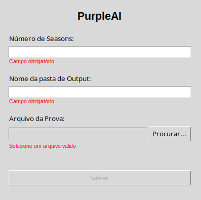

# PurpleAI

Sistema automatizado para resolução de provas da Olimpíada Purple Comet utilizando modelos de linguagem (LLM) através da API da Groq.

## Descrição

O PurpleAI foi desenvolvido para automatizar a resolução das provas da Olimpíada Purple Comet, utilizando 5 chaves de API da Groq para processar até 30 questões por execução. O sistema conta com um prompt inicial otimizado para auxiliar na interpretação e resolução dos problemas matemáticos.

### Características principais:
- Interface gráfica intuitiva desenvolvida em Tkinter
- Suporte a múltiplas chaves de API da Groq para otimização de performance  
- Processamento automático de questões da Purple Comet
- Sistema de configuração de seasons e organização de outputs
- Ferramenta de verificação e configuração de chaves de API

## Pré-requisitos

- Python 3.7 ou superior
- Conexão com a internet
- Chaves de API válidas da Groq

## Instalação

### Windows

1. **Clone o repositório:**
   ```bash
   git clone https://github.com/versianih/purpleai
   cd purpleai
   ```

2. **Crie e ative um ambiente virtual:**
   ```bash
   python -m venv venv
   venv\Scripts\activate
   ```

3. **Instale as dependências:**
   ```bash
   pip install -r requirements.txt
   ```


### Linux (Ubuntu/Debian)

1. **Instale as dependências do sistema:**
   ```bash
   sudo apt update
   sudo apt install python3-tk python3-venv python3-pip
   ```

2. **Clone o repositório:**
   ```bash
   git clone https://github.com/versianih/purpleai
   cd purpleai
   ```

3. **Crie e ative um ambiente virtual:**
   ```bash
   python3 -m venv venv
   source venv/bin/activate
   ```

4. **Instale as dependências Python:**
   ```bash
   pip install -r requirements.txt
   ```


### macOS

1. **Clone o repositório:**
   ```bash
   git clone https://github.com/versianih/purpleai
   cd purpleai
   ```

2. **Crie e ative um ambiente virtual:**
   ```bash
   python3 -m venv venv
   source venv/bin/activate
   ```

3. **Instale as dependências:**
   ```bash
   pip install -r requirements.txt
   ```


## Configuração Inicial

Antes de usar o sistema pela primeira vez, é necessário configurar as chaves de API da Groq:

```bash
python tools.py -e check
```

Este comando irá:
- Verificar se as chaves de API estão configuradas
- Permitir a adição de até 5 chaves de API da Groq
- Validar as chaves inseridas

## Como Usar

1. **Execute o sistema com a venv ativa:**
   ```bash
   python main.py
   ```

2. **Na interface gráfica, insira:**
    
      
   
   - **Número de seasons:** Quantidade de resoluções completas da prova pelo modelo de linguagem
   - **Nome da pasta de output:** Nome do diretório onde os resultados serão salvos dentro da pasta output/, presente na raiz do projeto
   - **Caminho do arquivo da prova:** Localização do arquivo PDF da prova da Purple Comet

3. **Clique em "Salvar"** para começar o processamento das questões

## Estrutura do Projeto

```
PurpleAI/
├── main.py           # Arquivo principal do sistema
├── tools.py          # Ferramenta de configuração de APIs
├── requirements.txt  # Dependências do projeto
├── README.md         # Este arquivo
├── AI/
|   ├── solver.py     # Responsável pela resolução da prova 
|   └── prompt.py     # Prompt fornecido ao modelo de linguagem
└── modules/
    ├── converter.py  # Responsável por converter o arquivo da prova em pdf para markdown
    ├── data.py       # Responsável por coletar as informações iniciais pela janela Tkinter
    ├── env.py        # Responsável por ler e editar o .env
    └── results.py    # Responsável por exibir e salvar os resultados das resoluções
```

## Contribuição

Contribuições são bem-vindas! Se você tiver sugestões de melhorias ou correções, sinta-se à vontade para abrir uma issue ou enviar um pull request.

## Licença

Esse projeto está sobre a Licensa MIT, saiba mais no arquivo [LICENSE](LICENSE).

## Contato

Se você tiver dúvidas, sugestões, fique à vontade para entrar em contato:

- GitHub: Versianih
- E-mail: versiani.ifes@gmail.com